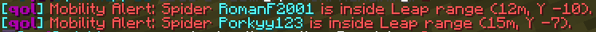

  <picture>
    <source media="(prefers-color-scheme: light)" srcset="assets/qol-pixel-logo.svg">
    
  </picture>

# qol

qol is a client-side Minecraft Forge 1.8.9 Mega Walls utility mod.

## Install

OneConfig is required. Install OneConfig in the same Forge 1.8.9 mods folder as `qol`.

Copy `build\libs\qol-1.0.0.jar` into your Forge 1.8.9 mods folder.

## Features

### Energy Tracker

- Keybind to report current energy.
- Optional display of hits needed and ability names.

### Phoenix Resurrection Tracker

- Shows Resurrection status in tablist with a Minecraft heart icon:
  - full heart: Resurrection available
  - empty heart: Resurrection used
- Optional Resurrection icon in enemy nametags.
- Optional chat notification when Resurrection is lost.

### Diamond Tracker

- Detects crafted diamond armor and diamond swords.
- Optional chat notifications for armor and swords.
- Optional deathmatch-only mode.

### Potion Tracker (Experimental)

- Tracks remaining healing potions per class.
- Optional potion icon and count in enemy nametags.
- Optional deathmatch-only mode.

### Strength Tracker

- Detects Zombie, Dreadlord, and Herobrine strength.
- Strength alerts print 3 times by default.
- `Only Show One Alert Message` changes alerts to a single message.
- Optional deathmatch-only mode.

### Mobility Alert

- Alerts when enemy Spider or Enderman players are inside relevant mobility range.
- Keybind toggle for enabling or disabling alerts in-game.
- Configurable chat print interval from 1 to 5 seconds.
- Optional class toggles for Spider and Enderman.
- Optional deathmatch-only mode.

## Configuration

Open OneConfig and find the `qol` mod under the `Mega Walls` category. Most modules are disabled by default and can be enabled independently.

- Phoenix nametags can show a heart before Phoenix players: green means Resurrection is available, red means Resurrection has been used.
- Potion nametags can show the tracked potion count after the player name, such as `[2]`.
- The Potion Tracker nametag color picker changes the potion count color. Minecraft 1.8 nametag text uses legacy chat colors, so the selected color is matched to the closest Minecraft text color.

Tablist display for Phoenix, Diamond, and Potion modules can also be toggled with their configured keybinds while in Mega Walls.
