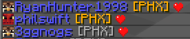
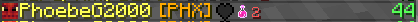
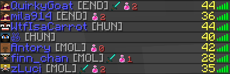
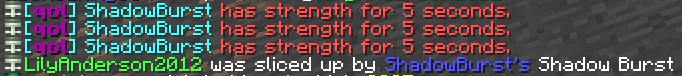
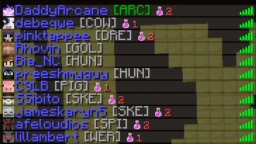
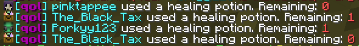
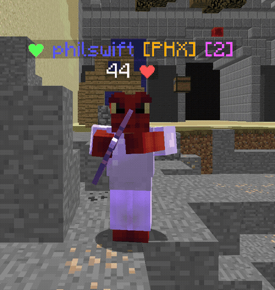

  <picture>
    <source media="(prefers-color-scheme: light)" srcset="assets/qol-pixel-logo.svg">
    
  </picture>

qol is a client-side Minecraft Forge 1.8.9 quality of life mod for Mega Walls.

---

## Install

[OneConfig](https://github.com/Polyfrost/OneConfig) is required. If your instance does not already have OneConfig, install the OneConfig Bootstrap mod for Forge 1.8.9.

Download the latest release jar then drop it into your mods folder.

---

## Features

### Energy Tracker

Displays ability energy information with an in-game keybind.

### Interaction Guard

Prevents accidental interactions while holding sword or items (disables right clicking crafting tables, chests, furnaces, etc.).

### Phoenix Resurrection Tracker

Tracks Phoenix resurrection state and displays it with heart indicators.

### Diamond Tracker

Detects non-kit diamond armor and diamond swords.

### Strength Tracker

Detects Zombie, Dreadlord, and Herobrine strength activations.

### Mobility Alert

Warns when enemy Spider or Enderman players are within relevant mobility threat range.

### Transparent Snowmen

Renders Snowman mobs translucently.

---

## Experimental

Experimental features are best-effort indicators and are not guaranteed to be 100% accurate.

### Potion Tracker

Tracks remaining healing potions for players.

### Spider Leap Alert

Detects nearby Spider Leap activation.

---

## Configuration

Most modules are disabled by default and can be enabled independently in OneConfig.

### General

- `Energy Tracker`: Reports current tracked energy, with optional hits-needed and ability-name details.
- `Interaction Guard`: Prevents opening crafting tables, chests, furnaces, and hoppers while holding a sword, with an optional empty-hand-only mode.
- `Phoenix Resurrection Tracker`: Enables resurrection tracking and optional chat notifications.
- `Diamond Tracker`: Enables non-kit diamond tracking, chat notifications, and deathmatch-only mode.
- `Strength Tracker`: Enables strength detection, Zombie strength detection, repeated alert behavior, and deathmatch-only mode.
- `Mobility Alert`: Enables Spider and Enderman range alerts, chat notifications, chat interval, keybind toggle, and deathmatch-only mode.

### Render

- `Phoenix Resurrection Tracker`: Shows resurrection hearts in the tablist and nametags.
- `Diamond Tracker`: Shows non-kit diamond armor and sword icons in the tablist.
- `Visuals`: Enables ally-only transparent Snowman rendering, optional all-team rendering, its keybind toggle, and opacity.

Phoenix nametag hearts are green when resurrection is available and red when it has been used. Potion nametags show the tracked potion count after the player name, such as `[2]`.

### Experimental

- `Potion Tracker`: Enables potion tracking, tablist display, nametag display, nametag color, chat notifications, and deathmatch-only mode.
- `Mobility Alert`: Enables the Spider Leap GUI alert, draggable Leap Alert HUD, compass HUD, compass position/radius controls, and sound packet debug output.

Tablist display for Phoenix, Diamond, and Potion modules can also be toggled with their configured keybinds while in Mega Walls.
