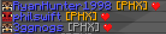
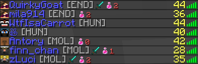
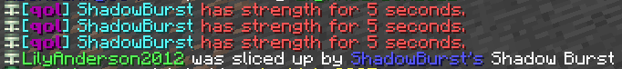
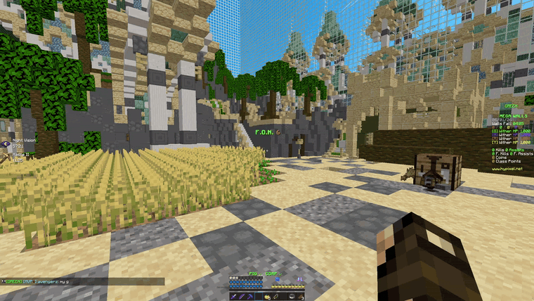
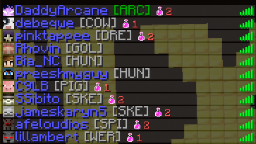
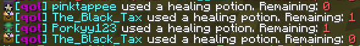
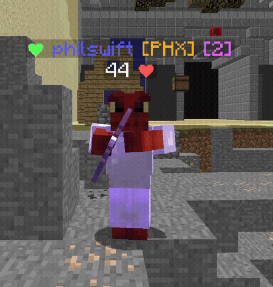

  <picture>
    <source media="(prefers-color-scheme: light)" srcset="assets/qol-pixel-logo.svg">
    
  </picture>

---

qol is a client-side Minecraft Forge 1.8.9 quality-of-life mod for Hypixel Mega Walls.

## Install

[OneConfig](https://github.com/Polyfrost/OneConfig) is required. If your instance does not already have OneConfig, install the OneConfig Bootstrap mod for Forge 1.8.9.

Download the latest qol release jar from [Releases](https://github.com/nickzyx/qol/releases), then drop the jar into your instance's mods folder.

## Features

- [Energy Announcer](#energy-announcer)
- [Interaction Guard](#interaction-guard)
- [Phoenix Resurrection Tracker](#phoenix-resurrection-tracker)
- [Diamond Tracker](#diamond-tracker)
- [Strength Tracker](#strength-tracker)
- [Waypoints](#waypoints)
- [Class Tracker](#class-tracker)
- [Mobility Alert](#mobility-alert)
- [Casino](#casino)
- [Transparent Snowmen](#transparent-snowmen)
- [Visible Barriers](#visible-barriers)
- [Auto Update](#auto-update)
- [Potion Tracker](#potion-tracker)
- [Spider Leap Alert](#spider-leap-alert)

### Energy Announcer

Sends your current ability energy as a chat message with an in-game keybind.

### Interaction Guard

Prevents accidental right-click interactions with crafting tables, chests, furnaces, while holding a sword. Also an optional empty-hand-only mode.

### Phoenix Resurrection Tracker

Tracks Phoenix resurrection state and displays it with colored heart indicators in the tablist and nametags.

  

  

### Diamond Tracker

Detects diamond armor and diamond swords that are not part of a player's class kit.

  

### Strength Tracker

Detects Zombie, Dreadlord, and Herobrine strength activations, with optional player outlines for active strength users.

  

### Waypoints

Place shared party waypoints by looking at a block or player and pressing the ping keybind. Location pings render as world markers with static labels, while player pings highlight the target player and can announce the target in public or party chat.

### Class Tracker

Counts player classes in the Mega Walls pregame queue from class skin hashes and shows the totals in a movable text HUD.

### Mobility Alert

Warns when enemy Spider or Enderman players are within relevant threat range.

### Casino

Replaces Hunter Force of Nature action bar text with a slot-style roll animation.

  

### Transparent Snowmen

Renders ally Snowman mobs translucently, with an option to apply the render to all Snowmen.

  

### Visible Barriers

Renders barrier blocks as selectable colored glass styles.

### Auto Update

Checks GitHub releases for newer versions and links to the releases page when an update is available.

---

## Experimental

> [!NOTE]
> Experimental features are best-effort indicators and are not guaranteed to be 100% accurate.

### Potion Tracker

Tracks health potions for players. Default predm tracking with option for only deathmatch.

  

  

### Spider Leap Alert

Detects nearby Spider Leap activation.

  

---

## Configuration

Most modules are disabled by default and can be enabled independently in OneConfig.

### General

- `Energy Announcer`: Sends your current ability energy as a chat message with the configured keybind.
- `Interaction Guard`: Prevents accidental right-click interactions with crafting tables, chests, furnaces, while holding a sword. Also an optional empty-hand-only mode.
- `Phoenix Resurrection Tracker`: Enables resurrection tracking and optional chat notifications.
- `Diamond Tracker`: Enables non-kit diamond tracking, chat notifications, and deathmatch-only mode.
- `Strength Tracker`: Enables strength detection, Zombie strength detection, player outlines, repeated alert behavior, and deathmatch-only mode.
- `Waypoints`: Configures shared waypoint pings, ping keybind, and message channel.
- `Class Tracker`: Enables pregame queue class counts, unknown player counts, the movable HUD, and text shadow.
- `Mobility Alert`: Enables enemy Spider and Enderman range alerts, chat notifications, chat interval, keybind toggle, and deathmatch-only mode.
- `Auto Update`: Checks GitHub releases for newer versions and links to the releases page when an update is available.

### Casino

- `Hunter F.O.N.`: Enables the casino-style Force of Nature HUD, keybind toggle, result sounds, roll sounds, roll sound type, draggable HUD mode, and text shadow.

### Render

- `Phoenix Resurrection Tracker`: Shows resurrection hearts in the tablist and nametags.
- `Diamond Tracker`: Shows non-kit diamond armor and sword icons in the tablist.
- `Waypoints`: Controls world marker rendering for location pings.
- `Barriers`: Enables visible barriers and chooses the glass color style. Restart Minecraft after changing the barrier style.
- `Snowmen`: Enables ally-only transparent Snowman rendering, optional all-team rendering, the render keybind toggle, and opacity.

  

Phoenix nametag hearts are green when resurrection is available and red when it has been used. Potion nametags show the tracked potion count after the player name, such as `[2]`.

### Experimental

- `Potion Tracker`: Enables potion tracking, tablist display, nametag display, nametag color, chat notifications, and deathmatch-only mode.
- `Mobility Alert`: Enables the Spider Leap alert and HUD. Reposition using OneConfig `Edit HUD` button. 
- `Mobility HUD`: Controls the compass HUD toggle, position, and marker radius.

### Development
> [!NOTE]
> Only use when developing or debugging.
- `Developer Debug`: Writes game logs to `.minecraft/qol-debug`.
